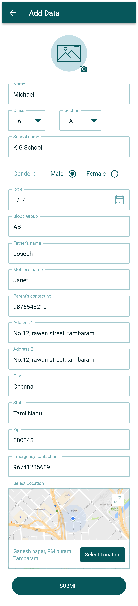
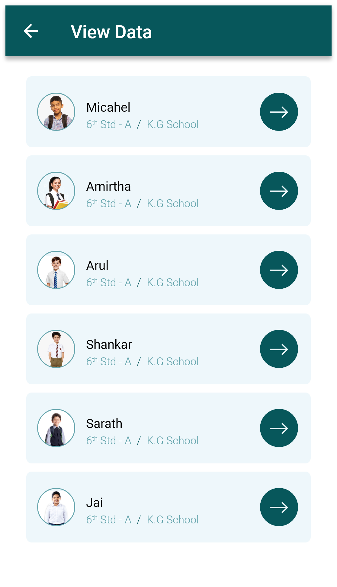
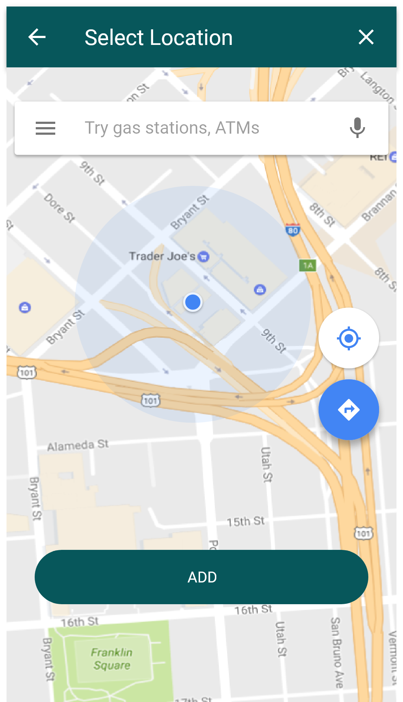
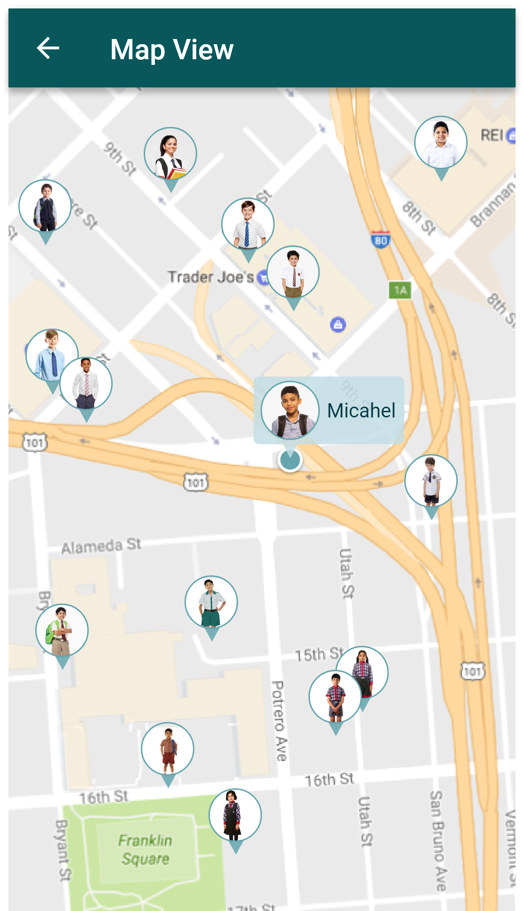
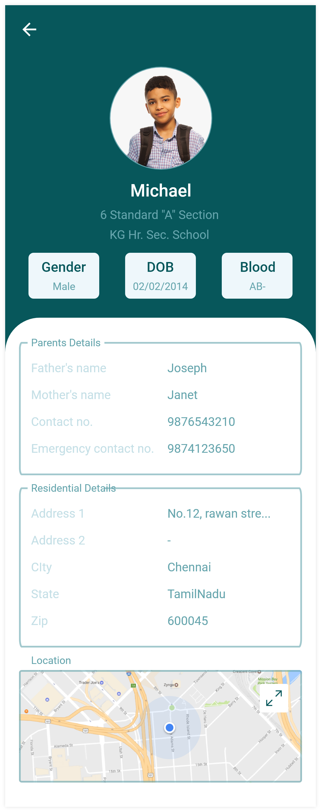

# 📱 Student Management App (React Native)

A **Student Management Mobile Application** built with **React Native** that allows users to manage student records, capture student details, and visualize student locations on a map.

This project demonstrates mobile development skills including **form handling, local database usage, location services, and map integration**.

---

# 🚀 Features

- 👤 Add new student details
- 📋 View student list
- 🔍 View individual student details
- 🗺️ Select student location using map
- 📍 Display students on map view
- 🖼️ Capture or upload student profile image
- 🔐 Authentication screens (Sign In / Sign Up)
- 📱 Clean and modern mobile UI

---

# 🛠️ Tech Stack

- React Native
- React Navigation
- SQLite (Local Database)
- React Native Maps
- React Native Image Picker
- React Native Permissions
- JavaScript (ES6)

---

# 📸 Screenshots

<table align="center">
<tr>
<td align="center">
<b>Welcome Screen</b><br>

</td>

<td align="center">
<b>Sign In</b><br>

</td>

<td align="center">
<b>Sign Up</b><br>

</td>
</tr>

<tr>
<td align="center">
<b>Dashboard</b><br>

</td>

<td align="center">
<b>Add Student</b><br>

</td>

<td align="center">
<b>Student List</b><br>

</td>
</tr>

<tr>
<td align="center">
<b>Select Map Location</b><br>

</td>

<td align="center">
<b>Map View</b><br>

</td>

<td align="center">
<b>Student Details</b><br>

</td>
</tr>
</table>

---

# 📦 Installation

Clone the repository

```
git clone https://github.com/logesh8039/student-management-react-native-app.git
```

Go to the project folder

```
cd student-management-react-native-app
```

Install dependencies

```
npm install
```

Run the Android app

```
npx react-native run-android
```

---

# 📂 Project Structure

```
student-management-react-native-app
│
├── android
├── ios
├── src
│   ├── components
│   ├── screens
│   ├── database
│   └── utils
│
├── screenshots
├── App.js
└── package.json
```

---

# 🎯 Purpose of the Project

This project demonstrates:

- Mobile UI development with React Native
- Form handling and validation
- Map integration and location selection
- Local database storage using SQLite
- Managing and displaying student records

---

# 👨‍💻 Author

**Logesh**

GitHub
https://github.com/logesh8039

---

⭐ If you like this project, please give it a star on GitHub.
